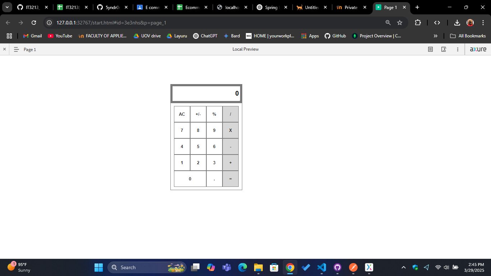

# Day 02 - Creating a Simple Calculator and its Interactions

This directory contains an exercise covering designing a calculator interface and complex interaction creation.

## Exercise List

### 1. Simple Calculator Interface
- Designing a simple Calculator interface
- Complex interaction creation
- Use of variables
- Creating interactions for all the numbers
- **Output**: 

## Getting Started
The exercise is implemented in the `Day02.rp` file. To run the exercises, open the `Day02.rp` file in Axure RP 9 and navigate to preview. Screenshots of the pages are provided in the `Day02` directory.
