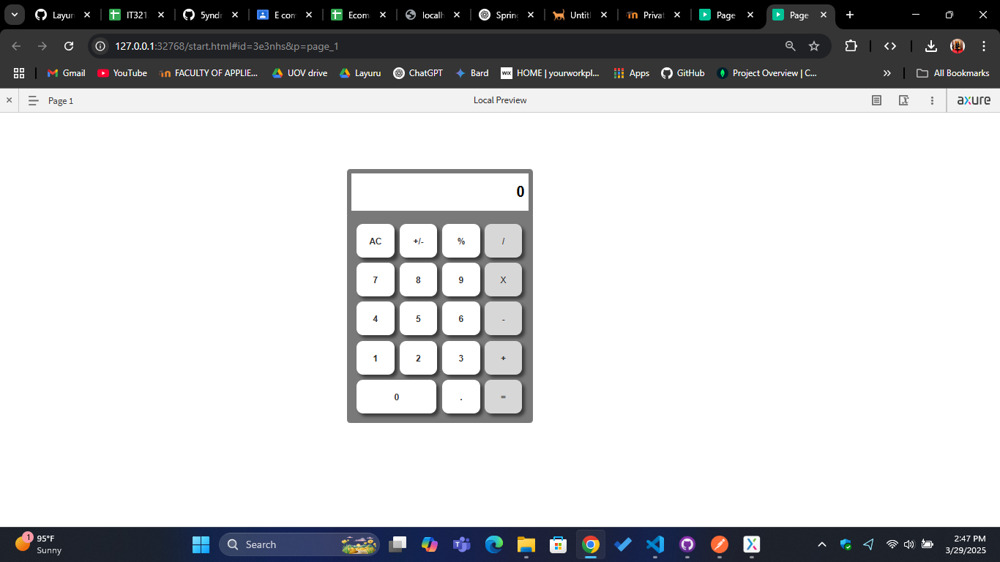

# Day 03 - Add interactions for operators of calculator

This directory contains a continuation of the exercise covering designing a calculator interface and its complex interaction creation.

## Exercise List

### 1. Add interactions for the calculator's operators
- Add interaction for "All Clear" button fully implemented
- Add interaction for "+/-" button fully implemented
- Add interaction for "." button fully implemented
- Add interaction for "+" button partially implemented
- **Output**: 

## Getting Started
The exercise is implemented in the `Calculator.rp` file. It is a continuation of the `Day02` exercise. With more interactions added, the calculator is now able to perform some basic operations. To run the exercises, open the `Calculator.rp` file in Axure RP 9 and navigate to preview. Screenshots of the pages are provided in the `Day03` directory. (pending)
